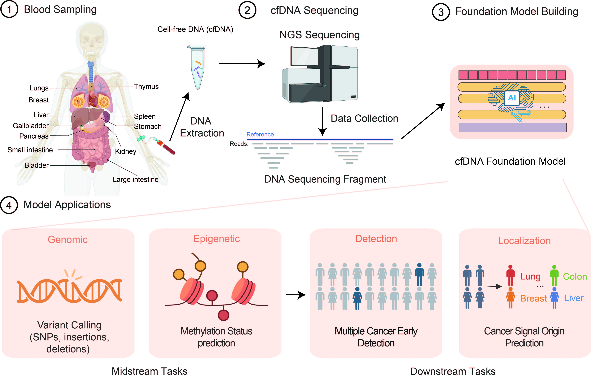

# USM-cfDNA

## A cfDNA foundation model for multi-cancer early detection and cancer signal origin prediction

Cell-free DNA (cfDNA) in plasma, originating from various tissue types, provides a non-invasive means to detect a wide range of diseases, including cancer. However, existing models do not fully exploit the genomics, epigenomics and fragmentomics information contained in cfDNA, and they often need costly high sequencing depth or special bisulfite treatment. To address this, we propose Unified Sequence Model (USM)-cfDNA, a novel large foundation model designed to extract multi-omics diagnostic information from cfDNA, enabling highly accurate multiple cancer early detection (MCED) and cancer signal origin (CSO) prediction. USM-cfDNA integrates both sequence information and fragmentation patterns of cfDNA across the genome, leveraging a specially designed two-dimensional receptive field for comprehensive multi-omics feature extraction.
- [USM-cfDNA](#usm-cfdna)
  - [A cfDNA foundation model for multi-cancer early detection and cancer signal origin prediction](#a-cfdna-foundation-model-for-multi-cancer-early-detection-and-cancer-signal-origin-prediction)
- [System requirements](#system-requirements)
  - [Hardware requirements](#hardware-requirements)
  - [Software requirements](#software-requirements)
    - [OS requirements](#os-requirements)
    - [Python dependencies](#python-dependencies)
- [Install guide](#install-guide)
  - [For Docker users](#for-docker-users)
    - [1-Pull docker image from docker-hub.](#1-pull-docker-image-from-docker-huboptional)
    - [2-clone the USM-cfDNA repository:](#2-clone-the-usm-cfdna-repository)
    - [3-Download the demo data and resource data from GoogleDrive or WeDrive:](#3-download-the-demo-data-and-resource-data-from-googledrive-or-wedrive)
    - [4-Start your docker and run examples:](#4-start-your-docker-and-run-examples)
      - [Option A: Run MCED + CSO from a precomputed feature table](#option-a-run-mced--cso-from-a-precomputed-feature-table)
      - [Option B: End-to-end MCED + CSO prediction from BAM](#option-a-run-mced--cso-from-a-precomputed-feature-table)
      - [Notes (when the default config does not match your machine)](#notes-when-the-default-config-does-not-match-your-machine)
    - [5-Run inference on your own data:](#5-run-inference-on-your-own-data)
      - [5.1 Prepare input files](#51-prepare-input-files)
      - [5.2 Run end-to-end inference](#52-run-end-to-end-inference)
      - [5.3 Outputs](#53-outputs)
        - [Predictions (`output/prediction/`)](#predictions-outputprediction)
        - [Features (`output/features/`)](#features-outputfeatures)
      - [5.4 Notes](#54-notes)
  - [For Conda users](#for-conda-users)
    - [1-Configure the environment.](#1-configure-the-environment)
    - [2-Refer to the Docker workflow for the following steps.](#2-refer-to-the-docker-workflow-for-the-following-steps)
- [Dataset](#dataset)
- [Disclaimer](#disclaimer)
- [Copyright](#copyright)
- [Contact](#contact)




# System requirements
## Hardware requirements
`USM-cfDNA` package requires a computer with sufficient memory for large-scale genomic data processing and NVIDIA GPUs to support operations.
## Software requirements
### OS requirements
This tool is supported for Linux. The tool has been tested on the following systems: <br>
+ CentOS Linux release 8.2.2.2004
+ Ubuntu 18.04.5 LTS
### Python dependencies
`USM-cfDNA` mainly depends on the Python scientific stack. <br>


+ Important packages include:
```
    python==3.9.18
    torch==2.5.1+cu124
    torchvision==0.20.1+cu124
    causal-conv1d==1.5.0
    flash-attn==2.7.4
    apex==0.1.0
    deepspeed==0.14.4
    transformers==4.52.4
    triton==3.1.0
    tqdm==4.66.4
    scikit-learn==1.6.1
```
+ `requirements/environment.yml` and `requirements/pip_install.sh` describes more details of the requirements.    


# Install guide

## For Docker users
### 1-Pull docker image from docker-hub.
```
docker pull coraz/usm-cfdna:latest
```

### 2-clone the USM-cfDNA repository:
```
# Make a directory to save USM-cfDNA project:

mkdir -p /path/to/your/directory/
cd /path/to/your/directory/
git clone https://github.com/TencentAILabHealthcare/USM-cfDNA.git
```

### 3-Download the demo data and resource data from [GoogleDrive](https://drive.google.com/file/d/124ZGOd3x7woThEDWxWeUBr17VgWlAtV2/view?usp=drive_link) or [WeDrive](https://drive.weixin.qq.com/s?k=AJEAIQdfAAoOmkX6b8):

It can be downloaded via the browser (**Option 1**) or by using the commands below (**Option 2**):

```bash
# install the tool "gdown"
python3 -m pip install gdown

# download the file
gdown 'https://drive.google.com/uc?id=124ZGOd3x7woThEDWxWeUBr17VgWlAtV2'
```
After downloading, please decompress the file with the following command:

```bash
unzip -P password usm_cfdna_resource.zip  # password is given in the manuscript in the section "Code Availability"
```

Then, place the downloaded folders into the **repo root** `USM-cfDNA/` and make sure the directory layout looks like this:

```text
USM-cfDNA/
├── ckpt/                 # model checkpoints
├── data/                 # demo data
├── figure/
├── output/               # generated outputs
├── projects/
├── requirements/
├── resource/             # resource data
└── tgnn/
```

Move the downloaded folders into the repo root:

```bash
# You should have multiple folders after downloading (e.g., ckpt/, data/, resource/).
mv /path/to/downloaded/{ckpt,data,resource} USM-cfDNA/
```

### 4-Start your docker and run examples:
```
# Please make sure you have the correct setting in `-v /path/to/your/directory/USM-cfDNA:/USM-cfDNA`:

docker run --name USM-cfDNA --gpus all --shm-size 1000G -v /path/to/your/directory/USM-cfDNA:/USM-cfDNA -it --rm  coraz/usm-cfdna:latest /bin/bash
```

Test USM-cfDNA with following commands:

Run commands under the repository root (`./USM-cfDNA`):

```bash
conda activate USM-cfDNA
cd USM-cfDNA
```

#### Option A: Run MCED + CSO from a precomputed feature table

```bash
bash ./projects/main/run_mced_cso_with_precomputed_feature.sh \
    --ckpt ckpt/model.bin \
    --pred-dir output/prediction \
    --feat-file data/sample1_feature.parquet
```

#### Option B: End-to-end MCED + CSO prediction from BAM

Features will be saved under `USM-cfDNA/output/features/`, and predictions will be saved under `USM-cfDNA/output/prediction/`.

**Recommended hardware (reference)**: the default settings were validated on the following machine:
- CPU: AMD EPYC 9K84 (96 cores) × 2 sockets (192 physical cores / 384 threads)  
- GPU: 8 × NVIDIA H20  
- RAM: 1.0 TB  

The full analytical pipeline may take several hours for execution, with total runtime varying according to hardware specifications.
```bash
bash ./projects/main/run_mced_cso.sh \
  --data-dir data \
  --resource-dir resource \
  --ckpt-dir ckpt \
  --output-dir output \
  --sample-id sample1
```

#### Notes (when the default config does not match your machine)

- **GPU count mismatch** (e.g., your machine has only 1 GPU but the default requests more GPUs) may trigger errors like:

  `Duplicate GPU detected : rank 3 and rank 0 both on CUDA device ...`

  In this case, explicitly set GPU numbers to the actual available GPU count:

```bash
# NEW: set MET GPUs
# NEW: set MUT GPUs

bash ./projects/main/run_mced_cso.sh \
  --data-dir data \
  --resource-dir resource \
  --ckpt-dir ckpt \
  --output-dir output \
  --sample-id sample1 \
  --met-host-gpu-num 1 \
  --mut-host-gpu-num 1
```

- **CUDA out of memory (GPU OOM)**: lower batch sizes:

```bash
# NEW: lower MET batch size
# NEW: lower MUT batch size

bash ./projects/main/run_mced_cso.sh \
  --data-dir data \
  --resource-dir resource \
  --ckpt-dir ckpt \
  --output-dir output \
  --sample-id sample1 \
  --met-batch-size 64 \
  --mut-batch-size 64
```

- **Host RAM OOM / too many CPU threads** (process killed): lower thread numbers:

```bash
# NEW: lower MET CPU threads
# NEW: lower MUT CPU threads

bash ./projects/main/run_mced_cso.sh \
  --data-dir data \
  --resource-dir resource \
  --ckpt-dir ckpt \
  --output-dir output \
  --sample-id sample1 \
  --met-num-threads 32 \
  --mut-num-threads 32
```

### 5-Run inference on your own data:

#### 5.1 Prepare input files

Put your BAM file and `meta.csv` under `USM-cfDNA/data/`:

```text
USM-cfDNA/data/
├── <SAMPLE_ID>.bam
└── meta.csv
```

A example of a `meta.csv` is provided as follows:

```csv
sample_id,age,sex
sample1,52,0
sample2,55,1
```

- `sample_id` must match the `--sample-id` argument and the BAM filename (i.e., `data/<sample_id>.bam`).
- `age` is an integer.
- `sex`: must be `0` (female) or `1` (male).


#### 5.2 Run end-to-end inference

From the repo root inside the container:

```bash
cd /USM-cfDNA

bash ./projects/main/run_mced_cso.sh \
  --data-dir data \
  --resource-dir resource \
  --ckpt-dir ckpt \
  --output-dir output \
  --sample-id <SAMPLE_ID>
```

#### 5.3 Outputs

After the run finishes, results will be written to:

##### Predictions (`output/prediction/`)
For each sample `<sample_id>`:
- MCED: `output/prediction/<sample_id>_mced.json`
- CSO:  `output/prediction/<sample_id>_cso.json`

##### Features (`output/features/`)
- Combined feature table: `output/features/combined_feature/<sample_id>_feature.csv`
- CNA: `output/features/cna/<sample_id>_cna.json` and `output/features/cna/<sample_id>_cna.png`
- End-motif: `output/features/end_motif/<sample_id>_end_motif.json`
- End-motif (all-CG): `output/features/end_motif_all_cg/<sample_id>_end_motif.json`
- Methylation: `output/features/methylation/<sample_id>/methylation_prediction.jsonl`
- Mutation: `output/features/mutation/<sample_id>/variant_prediction.vcf`
#### 5.4 Notes

- If your BAM file is named differently, rename it to `<SAMPLE_ID>.bam` to match `--sample-id`.
- Make sure your BAM is indexed (the pipeline may require `data/<SAMPLE_ID>.bam.bai`). If missing, generate it with:
  ```bash
  samtools index data/<SAMPLE_ID>.bam
  ```
- If you encounter GPU/RAM issues, use the troubleshooting options in Section 5 (GPU count, batch size, num-threads).

## For Conda users

### 1-Configure the environment.

```
git clone https://github.com/TencentAILabHealthcare/USM-cfDNA.git
cd ./USM-cfDNA
conda env create -n USM-cfDNA -f requirements/environment.yml
conda activate USM-cfDNA
bash requirements/pip_install.sh
conda deactivate
```

### 2-Refer to the Docker workflow for the following steps.
[Start from “3-Download the demo data and resource data”](#3-download-the-demo-data-and-resource-data-from-googledrive-or-wedrive)

# Dataset

The demo data and other resource data can be downloaded from [GoogleDrive](https://drive.google.com/file/d/124ZGOd3x7woThEDWxWeUBr17VgWlAtV2/view?usp=drive_link) or [WeDrive](https://drive.weixin.qq.com/s?k=AJEAIQdfAAoOmkX6b8).

# Disclaimer
This tool is for research purposes and not approved for clinical use.

# Copyright

This tool is developed by Tencent AI for Life Sciences Lab.

The copyright holder for this project is Tencent AI for Life Sciences Lab.

All rights reserved.

# Contact

Please get in touch with louisyuzhao@tencent.com if you have any questions. 